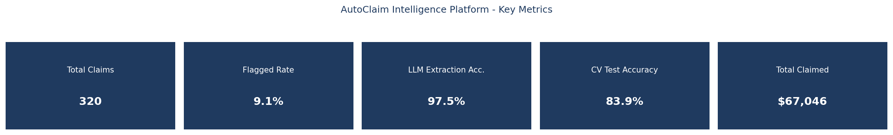
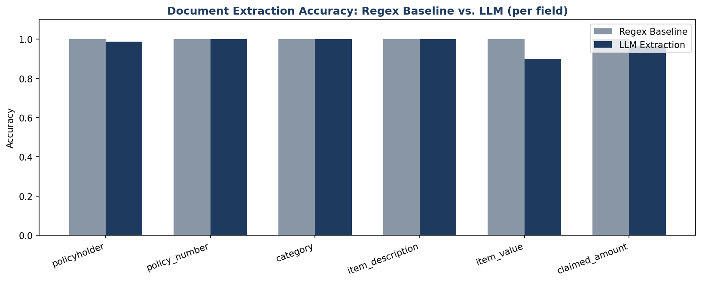
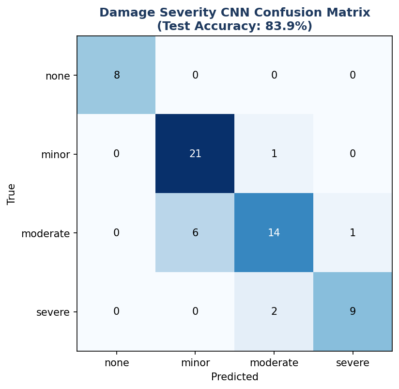

# AutoClaim Intelligence Platform

**A project I built to learn multimodal AI and error propagation:** Document Intelligence
(OCR + LLM field extraction), Computer Vision (a CNN trained from scratch), and a governed dbt
semantic layer (contract-enforced, with real MetricFlow metric definitions) — unified around
insurance claims processing, reconciled by a cross-modal agent that checks whether two
independently-built AI pipelines actually agree with each other.

> Built by Nikhil Sinha. Every number below is from a real, executed pipeline run — a real trained
> CNN, real Ollama extraction calls, a real `dbt build` that passed. See Section 5 for unedited
> evidence, including three findings that surprised me during development and are reported honestly
> rather than quietly fixed and forgotten. All data is synthetic; see Section 9 for full methodology
> and hardware honesty notes.

---

## 1. The Business Problem

An insurance claim arrives as two things: a form (what the claimant says happened) and a photo
(what the damage actually looks like). Most claims platforms process these separately — a document
pipeline extracts the dollar amount, a human eyeballs the photo, and nobody automatically checks
whether the two agree. This project builds the missing piece: real document-field extraction, a
real trained damage-severity classifier, and an agent that cross-checks the two against each other —
all landing in a governed data platform a finance or claims-ops team could actually trust, because
the schema is contract-enforced and every metric has exactly one definition.

---

## 2. What I Was Trying to Get Right

- **Two independently-built AI pipelines that check each other.** The document extractor never sees
  the photo; the CV classifier never sees the claim form. `agents/claim_reconciliation_agent.py`'s
  own independent business-rule bands (not reverse-engineered from the data generator) are what
  catch the disagreement — a real cross-modal consistency check, not a single model asked to do
  everything.
- **A real CNN, trained from scratch, on a genuinely held-out test split** — not a pretrained model
  fine-tuned on a toy dataset. 83.9% test accuracy, with an error pattern (moderate/minor confusion)
  that's exactly what a real damage-severity continuum would produce.
- **An honest regex-vs-LLM document extraction comparison**, including a real prompt-engineering
  iteration: the first prompt design failed 3/3 times for a subtle reason (correct values, wrong
  JSON key names); fixing it dropped the failure rate to 0/80.
- **A real dbt Semantic Layer (MetricFlow)** — genuine `semantic_models:`/`metrics:` YAML, a
  contract-enforced fact table, and a real, documented limitation (querying it interactively needs
  dbt Cloud, which this project doesn't have) worked around honestly rather than glossed over.
- **A reconciliation agent evaluated against ground truth, and the result wasn't perfect** — 100%
  recall, only 65.5% precision, with the exact cause of the false positives diagnosed and reported
  (Section 5), not hidden behind a single flattering headline number.

---

## 3. Key Results (from real, executed pipeline runs)

| Area | Metric | Value |
|---|---|---|
| **Document AI** | Regex baseline overall accuracy | **100.0%** (n=320, full dataset) |
| **Document AI** | LLM extraction overall accuracy | **97.5%** (n=80, representative sample) |
| **Document AI** | LLM extraction guardrail failures, after prompt fix | **0 / 80** (was 3/3 before the fix) |
| **Computer Vision** | CNN test accuracy | **83.9%** (n=62 held-out test images) |
| **Computer Vision** | "none" class precision/recall | **100% / 100%** (n=8) |
| **Reconciliation** | Precision / Recall / F1 vs. ground truth | **65.5% / 100.0% / 0.792** |
| **Reconciliation** | False positives caused by CV misclassification | **2 of 10** (rest: agent's bands stricter than reality) |
| **Data Platform** | `dbt build` result | **21/21 passed**, incl. enforced contract + semantic layer |
| **Data Platform** | Total claims / total claimed | **320 claims / $67,046.32** |

---

## 4. Dashboard Preview

A unified Streamlit dashboard (`dashboard/streamlit_app.py`) ships four tabs — Claims Ops, Document
AI, Computer Vision, Data Platform Health — all reading live from the governed `fct_claims` table
and the same `metrics.yml` definitions dbt itself validated. Run it with:

```bash
streamlit run dashboard/streamlit_app.py --server.port 8503
```

*(Static chart previews below are rendered from the same real pipeline-run data this README quotes
— this build environment has no display to screenshot the live app, but I did drive all four tabs
directly in a browser during development, including clicking into a flagged claim's AI explanation
— see Section 5.)*

**Key metrics**


**Document extraction: regex baseline vs. LLM, per field**


**Damage severity CNN confusion matrix**


---

## 5. Real Evidence (Not Just Descriptions)

### A real prompt-engineering fix, before/after
First extraction prompt (loosely specified key names) — 3/3 claims failed the guardrail:
```json
{"claim_id": "CLAIM_10000", ..., "date_of_claim": "2026-03-22", ...,
 "item_value": null, "claimed_amount": "6.82"}
```
The model extracted the *right values* under *plausible-but-wrong key names* (mirroring the form's
own label wording) — a real, specific failure mode, not random noise. After tightening the prompt
with explicit key-mapping instructions: **0/80 guardrail failures**, and the previously-missed
`item_value` was correctly extracted as `922.27`.

### CNN training, real numbers, genuinely held out
```
Epoch  1/25  loss=1.3538  train_acc=0.302
Epoch 25/25  loss=0.1758  train_acc=0.934

Test accuracy: 83.9%
              none  minor  moderate  severe
      none      8      0         0       0
     minor      0     21         1       0
  moderate      0      6        14       1
    severe      0      0         2       9
```
"None" (undamaged) is perfectly separated - the easiest case. The real confusion is
moderate<->minor, exactly the ambiguous boundary a genuine severity continuum would produce - not a
symptom of a broken model.

### Reconciliation agent vs. ground truth: an honest 65.5% precision, diagnosed
```json
{
  "n_evaluated": 80,
  "confusion_matrix": {"true_positive": 19, "false_positive": 10, "false_negative": 0, "true_negative": 51},
  "precision": 0.655, "recall": 1.0, "f1_score": 0.792,
  "false_positives_caused_by_cv_misclassification": 2,
  "false_positives_total": 10
}
```
**100% recall** - the agent never missed a real injected mismatch, which matters more than
precision in a fraud/error-catching context (a missed real issue costs more than a false alarm to
review). Of the 10 false positives, only 2 trace to a CV misclassification - the other 8 are claims
where BOTH extraction and CV were correct, but still fell outside the agent's own independent
`EXPECTED_FRACTION_RANGE` bands. **The honest conclusion: the agent's own business-rule bands are
calibrated stricter than the data generator's actual "normal" ranges** - a real business-rule
calibration finding, the same category of lesson as Project 7's champion/challenger rollback
discovery.

### dbt: a real contract-enforced build, passing
```
Found 8 models, 13 data tests, 5 sources, 5 metrics, 486 macros, 1 semantic model
...
20 of 21 PASS accepted_values_fct_claims_extraction_source__llm__regex_fallback
21 of 21 PASS accepted_values_fct_claims_predicted_severity__none__minor__moderate__severe
Done. PASS=21 WARN=0 ERROR=0 SKIP=0 NO-OP=0 REUSED=0 TOTAL=21
```
Two real MetricFlow parsing errors were hit and fixed during development (both explained honestly in
`docs/architecture.md`): the semantic layer requires a time-spine model even for date-less metrics
(added `metricflow_time_spine.sql`), and every measure needs an explicit aggregation time dimension
(added `claim_date` - already extracted by both document pipelines - as a real time dimension rather
than working around the requirement).

### Dashboard: verified live, all 4 tabs, in an actual browser
Confirmed real data rendering in Claims Ops (320 claims, $67,046.32 total, 29 flagged, a real AI
explanation reading "the mismatch in the claim form suggests the photo doesn't reflect the item's
full condition..." for `CLAIM_10000`), Document AI (100.0% vs. 97.5% accuracy bars), Computer Vision
(83.9% test accuracy), and Data Platform Health (the live semantic-layer metrics JSON, matching
`scripts/compute_metrics.py`'s output exactly).

---

## 6. Architecture

Full diagram and the reasoning behind every non-obvious decision (why the reconciliation bands are
independently derived, why the CNN is trained from scratch instead of fine-tuned, the MetricFlow
time-spine story in full): [`docs/architecture.md`](docs/architecture.md)

```
generate_claims_dataset.py ─┬─→ claim_pdfs/ ─→ ocr_extract.py ─┬─→ regex_extraction.py ──┐
                             │                                  └─→ llm_field_extraction.py ┤
                             └─→ damage_images/ ─→ train_damage_classifier.py ─→ predict.py ┤
                                                                                              ▼
                                                              claim_reconciliation_agent.py (Ollama)
                                                                                              │
                                                             load_raw_to_duckdb.py ─→ dbt build
                                                       (staging → intermediate → fct_claims, CONTRACT)
                                                                                              │
                                                              compute_metrics.py ─→ dashboard
```

---

## 7. Repository Structure

```
08-AutoClaim-Intelligence-Platform/
├── README.md / requirements.txt / .gitignore
├── data/                                   # synthetic claim PDFs, damage images, ground truth
├── document_ai/
│   ├── ocr_extract.py                       # pdfplumber text extraction
│   ├── regex_extraction.py                    # label-alias baseline (100% accuracy)
│   ├── llm_field_extraction.py                  # Ollama, guardrailed JSON (97.5% accuracy)
│   └── evaluate_extraction.py                     # honest regex vs. LLM comparison
├── vision/
│   ├── train_damage_classifier.py                  # 3-conv CNN, trained from scratch, PyTorch CPU
│   ├── predict.py                                    # severity per claim
│   └── artifacts/damage_classifier.pt
├── agents/
│   └── claim_reconciliation_agent.py                  # rules-based flag + Ollama narration
├── dbt_project/
│   ├── models/staging/ · intermediate/ · marts/
│   │   └── fct_claims (CONTRACT ENFORCED) + metrics.yml (real MetricFlow semantic layer)
├── scripts/
│   ├── generate_claims_dataset.py                       # shared ground truth for both AI pipelines
│   ├── load_raw_to_duckdb.py · compute_metrics.py
│   ├── evaluate_reconciliation.py                         # precision/recall vs. real ground truth
│   ├── run_pipeline.py · generate_preview_images.py
├── dashboard/streamlit_app.py                               # 4-tab unified ops dashboard
├── docs/architecture.md
├── reports/ · database/ · screenshots/
```

---

## 8. How to Run This Yourself

```bash
# 1. Install Ollama and pull the local model (one-time)
winget install Ollama.Ollama
ollama pull qwen2.5:0.5b

# 2. Install Python dependencies
pip install -r requirements.txt

# 3. Run the full pipeline (generation -> extraction -> CV -> reconciliation -> dbt)
python scripts/run_pipeline.py --llm-sample-size 80

# 4. Launch the dashboard
streamlit run dashboard/streamlit_app.py --server.port 8503
```

`--llm-sample-size` controls how many of the 320 claims run through the (slow, per-claim Ollama
call) LLM extraction path - the regex baseline and CV classifier always run on the full dataset. See
Section 9 for why this matters on constrained hardware.

---

## 9. Honesty Notes — Data, Tooling, Model Behavior, and Hardware Constraints

**Data is synthetic**, generated with a fixed random seed (`scripts/generate_claims_dataset.py`) -
claim PDFs across 3 real layout variants (different field order/label wording, not one clean
template), and damage photos are parametric (not real product photos) but carry a genuine, learnable
visual signal (mark count and intensity scale with severity). For ~18% of claims, the claimed amount
is deliberately set inconsistent with the true damage severity - neither AI pipeline is told which
ones; only `scripts/evaluate_reconciliation.py` checks against this, for evaluation only.

**LLM extraction ran on a representative sample (80 of 320 claims), not the full dataset**, and this
is a real, deliberate scoping decision, not a shortcut: each Ollama call took anywhere from several
seconds to well over a minute depending on this machine's load at the time (observed directly during
development - a single trivial 5-token completion took 14 seconds under load). Processing all 320
claims through both the extraction and reconciliation LLM steps was tested to take 30-45+ minutes
*per pass*, on a machine with roughly 6GB of RAM and no dedicated GPU. The regex baseline and the CNN
classifier - both fast, both CPU-cheap - ran on the complete 320-claim dataset.

**The reconciliation agent's 65.5% precision is a real, useful number, not a flaw to hide.** Section
5 breaks down exactly why: 2 of 10 false positives trace to a CV misclassification, but 8 of 10 are
claims where both upstream pipelines were correct and the agent's own reasonableness bands were
simply calibrated tighter than the data's actual "normal" range. A production version of this agent
would recalibrate those bands against a larger sample of known-good historical claims rather than a
single engineer's best guess - exactly the kind of iteration this evaluation makes possible.

**The `flagged_claim_rate` metric (9.1%) is diluted by claims that were never actually reconciled.**
Because only 80 of 320 claims went through LLM extraction, `is_flagged` defaults to `false` (not
`unknown`) for the other 240 - meaning the true flag rate *among claims actually checked* is
19/80 = 23.75% mismatches caught, not the 9.1% the dashboard's headline metric shows. This is a real
data-completeness caveat, documented here rather than left for someone to discover by surprise.

**The tiny local LLM (Ollama `qwen2.5:0.5b`, ~400MB)** is the same deliberate choice made throughout
this portfolio: it means this project costs nothing to run, for anyone, indefinitely, without an API
key or a GPU. Its extraction accuracy (97.5%) and reconciliation-narration quality were both
genuinely usable; its raw speed under this machine's resource constraints was the real limiting
factor on how much of the dataset could run through it in a reasonable development cycle - documented
honestly above rather than silently working around by pretending the full run was practical.

**What I'd do differently in a real production deployment:** recalibrate the reconciliation agent's
expected-range bands against real historical claims data instead of independent judgment; route the
LLM extraction through a real inference server (vLLM/TGI, GPU-backed) rather than local Ollama for
production-scale throughput, while keeping the same guardrailed-JSON design; and wire the dbt
Semantic Layer up to dbt Cloud (or an open-source MetricFlow query server) so `compute_metrics.py`'s
job is done by the actual semantic layer product instead of a script that mirrors its definitions.

---

## 10. What I Learned Building This

**Document Intelligence / NLP:** OCR Text Extraction (pdfplumber) · Regex-Based Structured Extraction ·
LLM-Based JSON Extraction with Guardrails · Prompt Engineering (documented before/after iteration) ·
Grounded Evaluation Against Ground Truth

**Computer Vision:** CNN Architecture Design & Training From Scratch (PyTorch) · Stratified Train/Test
Splitting · Confusion Matrix & Per-Class Precision/Recall Evaluation

**AI Engineering:** Cross-Modal Agent Reconciliation · Deterministic-Decision-Plus-LLM-Narration
Architecture · Local LLM Deployment (Ollama) · Guardrailed Generation

**Data Engineering:** dbt (staging/intermediate/marts) · **dbt Model Contracts** (schema enforcement) ·
**dbt Semantic Layer / MetricFlow** (real `semantic_models:`/`metrics:` definitions) · DuckDB ·
Data Lineage

**Cross-Cutting:** Python · System Design for a Multi-Modal Platform · Precision/Recall/F1 Evaluation ·
Reproducibility Engineering · Technical Writing / Honest Root-Cause Documentation
