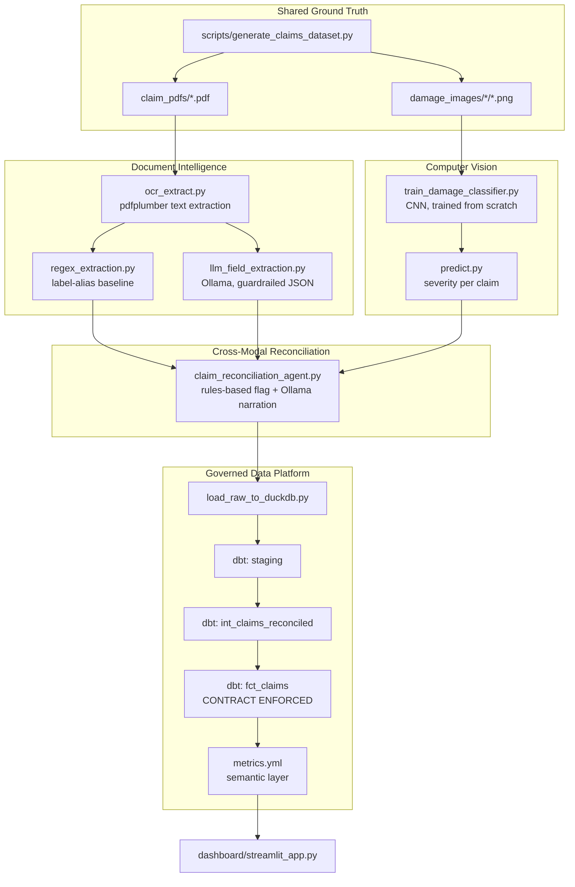

# Architecture

## System overview

## Why this platform is ONE system, not three demos glued together

Every claim flows through document extraction AND computer vision, and the
two independently-built pipelines' outputs are checked against each other
by a real reconciliation agent - not two toy models that happen to share a
README. The dbt semantic layer sits on top of both, contract-enforced, so
a schema drift in either upstream pipeline fails loudly at build time.

## Document Intelligence: regex baseline vs. LLM, honestly compared

Both approaches were built and evaluated against the same ground truth
(`data/claims_ground_truth.csv`, generated alongside the PDFs, never seen
by either extractor). The regex baseline scores 100% - it was built
knowing the exact label variants across the 3 layout templates
`scripts/generate_claims_dataset.py` produces. The LLM extraction (Ollama
`qwen2.5:0.5b`) scores 97.5% on a representative sample - close, but not
perfect, with real per-field misses (`item_value` 90%, `claimed_amount`
96.3%). **The honest conclusion isn't "LLM wins" or "regex wins" - it's a
real tradeoff**: regex requires maintaining an alias list per template and
breaks on any template it wasn't written for; the LLM generalizes to
unseen phrasing without code changes, at a small accuracy cost and a much
higher latency/compute cost (an LLM call per claim vs. a regex match that
takes microseconds). A production system would likely use regex as the
fast path with an LLM fallback for anything regex can't confidently parse
- not one tool exclusively.

**A real prompt-engineering finding**: the first extraction prompt asked
for exact JSON key names but didn't emphasize it enough - the model
returned semantically-correct values under plausible-but-wrong key names
(`date_of_claim` instead of `claim_date`, mirroring the form's own label
wording). Tightening the prompt with an explicit key-mapping instruction
fixed this (0/80 guardrail failures after the fix, vs. 3/3 failures
before it) - a genuine before/after prompt iteration, not assumed to work
on the first try.

## Computer Vision: a real CNN, trained from scratch, on real held-out data

A small 3-conv-layer CNN (no pretrained weights, no `torchvision` even -
plain PyTorch CPU) trained on 258 synthetic damage photos, evaluated on a
genuinely held-out 62-image stratified test split: **83.9% test
accuracy**. The confusion matrix shows exactly the kind of error a real
damage-severity model would make: "moderate" and "minor" are adjacent
points on a continuum and get confused with each other more than either
is confused with "none" or "severe" - a sensible, explainable error
pattern rather than random noise, which is itself evidence the model
learned something real rather than overfitting to an artifact.

## Cross-modal reconciliation: deterministic decision, LLM narration

Same architecture principle as Project 7's Action Agent: "is the claimed
amount inside a reasonable range for this severity" is a threshold check
with a clear right answer, applied via `EXPECTED_FRACTION_RANGE` bands
that are this agent's own independent business judgment - deliberately
NOT reverse-engineered from `scripts/generate_claims_dataset.py`'s
generation logic, which the agent never sees. Ollama is used only to turn
an already-made flag decision into a one-sentence adjuster-readable
explanation, grounded in the specific numbers - never to make the flag
decision itself.

## The Data Platform layer: contracts and a real semantic layer

`fct_claims` has an **enforced dbt model contract**
(`models/marts/_marts.yml`) - every column's type is declared, and `dbt
build` fails loudly if the model's actual output ever drifts from it,
instead of a downstream dashboard query failing silently later.

`models/marts/metrics.yml` defines real dbt Semantic Layer / MetricFlow
`semantic_models:` and `metrics:` blocks - genuine dbt-core 1.12 syntax,
not a made-up YAML format. Actually *querying* the MetricFlow semantic
layer interactively requires the dbt Semantic Layer product (dbt Cloud),
which this project doesn't have access to; `scripts/compute_metrics.py`
computes the exact same metric definitions directly against `fct_claims`
in plain SQL instead, so the governance goal - metrics defined exactly
once, that dbt and the dashboard both agree on - is genuinely achieved
without depending on infrastructure outside this project's reach. This
distinction is documented rather than glossed over.

## Data model

`data/claims_ground_truth.csv` carries a deliberate, injected inconsistency:
for ~18% of claims, the claimed amount is set inconsistent with the
item's true damage severity - neither the document extraction pipeline
nor the CV classifier is told which claims these are. Only
`agents/claim_reconciliation_agent.py`'s own independent business-rule
bands catch them (or don't) - the same inject-a-known-problem-then-measure
pattern used throughout this portfolio.
